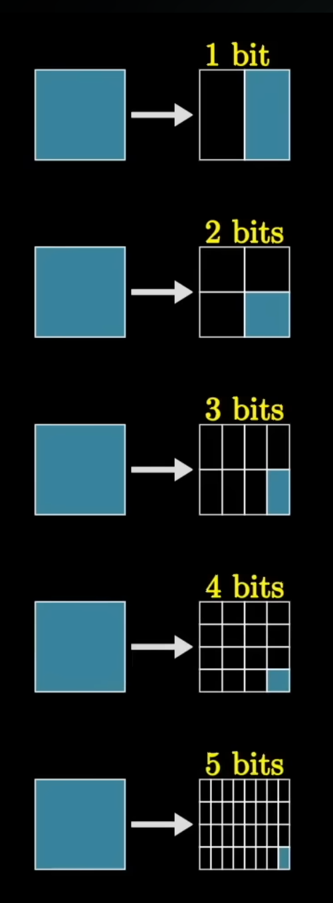
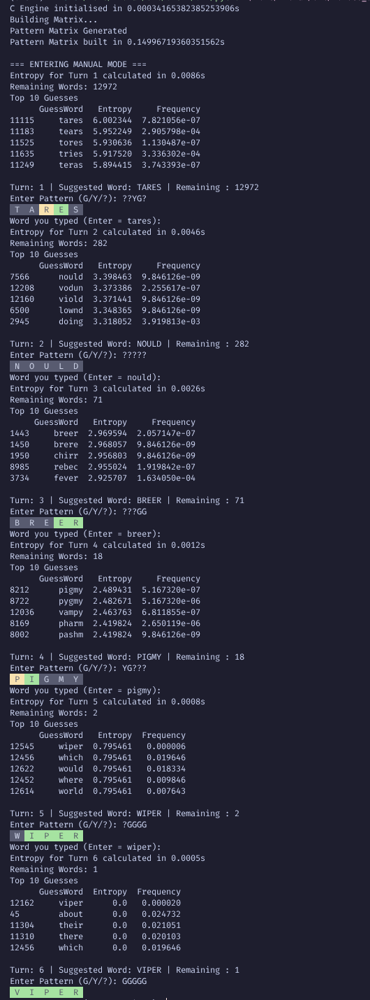
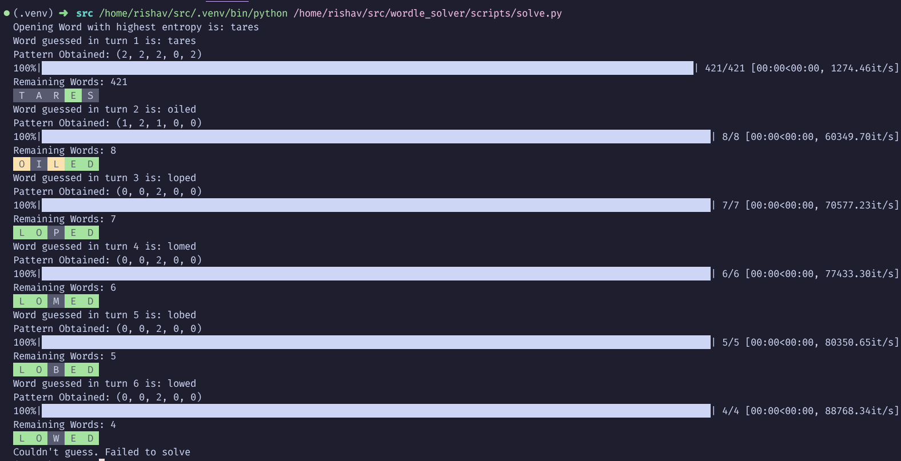
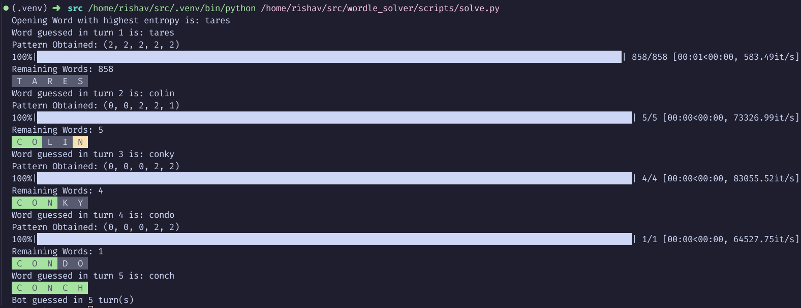
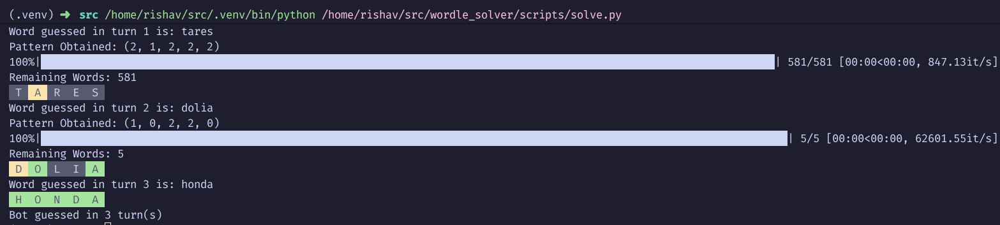
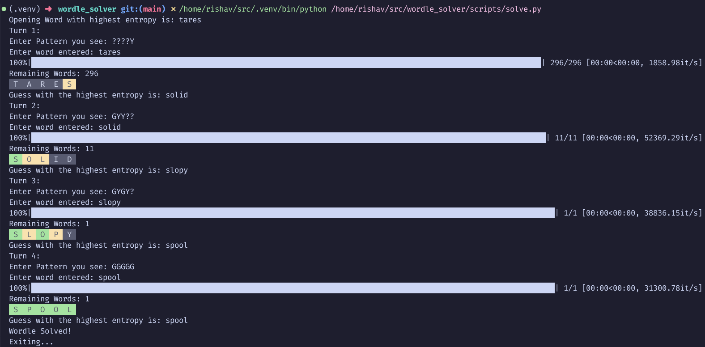

# Wordle Solver

An entropy-based Wordle solver using information theory.

## TL;DR
Built an entropy-based Wordle solver inspired by information theory.
Uses a **C shared library** for fast pattern matrix computation.
Achieves **median solve in 4 turns**, **mean of ~3.58 turns** with 99.6% win rate for all 12,972 words and 100% win rate for 2,315 answer words.
**Quick Links:** [Results](#results) • [How It Works](#my-approach) • [Hardest/Easiest Words](#hardest-and-easiest-words-to-solve) • [Installation](#installation)

---

## The Story

I regularly play Wordle. I had just finished my 3rd semester, quite bored at home, and hadn't been able to guess the Wordle word of the day for 3 days straight! Needless to say, I was kinda frustrated. I was browsing YouTube when I came across the above-mentioned 3Blue1Brown video where he talks about using entropy to solve puzzles such as... wait for it... Wordle!

Now, here I am bored, haven't been able to solve Wordle for 3 days, just had a semester-long class on random variables, and also needed to practice some programming. What more reason do I need? And that's how I started working on this script to solve Wordle puzzles using information theory.

---

## What is Wordle?

Wordle is a fun word game where you need to guess the word of the day, which is a five-letter word. If you guess wrong, you get hints:

- **Green** — The letter is present in the word and in the correct position
- **Yellow** — The letter is present in the word but not in the correct position  
- **Gray** — The letter is not present in the word at all

The official Wordle word list contains 12,973 accepted words. That's a huge list! How do we even figure out which word is best to start with? Can we somehow quantify the amount of information each word gives us? How do we measure the quality of a guess?

---

## Measuring Information

Information is measured in bits (*I*), where:

$$I = \log_2\left(\frac{1}{p(x)}\right)$$

Here, *p(x)* is the probability of the event occurring. For example, in English, about half of the five-letter words contain the letter 's'. So, this observation gives us around 1 bit of information. If a letter is present in about a quarter of the five-letter words, it gives $\log_2(4) = 2$ bits. A probability of 1/8 gives 3 bits, and so on.



This method of measuring information is especially nice in the context of words, since saying an event has 20 bits of information is much easier than saying it has a probability of 0.00000095. But the best part is that information **adds together**: if one event gives you 3 bits and another gives you 2 bits, and they're independent, then $I_{\text{total}} = I_1 + I_2$.

---

## Entropy and the Bot

The goal here is to design a Wordle bot that uses this information to solve the puzzle. Specifically, I'm using **entropy**, as developed by Claude Shannon.

Entropy is a measure of the "flatness" of a distribution, or the amount of randomness present in the data, i.e., how much information it holds.

Formally:

$$E[I] = \sum p(x) \times \log_2\left(\frac{1}{p(x)}\right)$$

---

## My Approach

### Version 2
The solver now uses a **hybrid Python/C architecture**:
- **C Engine (`wordle_engine.c`)**: Handles computationally intensive tasks like building the pattern matrix and calculating entropies using OpenMP parallelization
- **Python (`solver.py`)**: Manages data visualization, user interaction, file I/O, and orchestrates the C library
### Step 1: Precompute the Pattern Matrix

Rather than computing patterns on-the-fly, we build a **lookup table (LUT)** of all word-pair patterns:
- For N words, this creates an N×N matrix where `matrix[i][j]` = pattern between word i and word j.
- Patterns are stored as Base-3 integers (0-242) representing the 243 possible outcomes.
- Uses Horner's method for efficient Base-3 to integer conversion.
- OpenMP parallelization speeds up matrix generation.

### Step 2: Entropy Calculation with Frequency Weighting

- Words are weighted by real-world usage frequency (from `wordfreq` library)
- Common words are prioritized as likely Wordle answers
- Shannon entropy is calculated: `H = -Σ p(x) × log₂(p(x))`
- The C engine processes all 12,973² pattern lookups as O(1) memory accesses

### Step 3: Guessing and Filtering

- After each guess, filter valid targets using the precomputed matrix
- Recalculate entropy only for remaining valid words
- Select the word with highest entropy (ties broken by validity followed by frequency)

### Version 1

#### Step 1: Find the Best Starting Word

The first step was to find a word that would eliminate the most possible candidates—in other words, the word with the most information (maximum entropy).

- A function was written to calculate the Wordle pattern: 0 → Green, 1 → Yellow, 2 → Gray
- A list of all possible patterns was made (for five letters and three colors, that's $3^5 = 243$ patterns)
- For each word, the pattern it would produce with every other word was calculated
- The frequency of each pattern was counted and the probability of each pattern was calculated
- Using the entropy formula, the information content for each word was computed
- This was repeated for every word in the list (takes a long time to compute!)
- Finally, the entropy values for each word were saved in a pandas DataFrame and exported as a CSV for later use. Since the opening word's entropy is always the same, we can just compute it once and use it. This saves a ton of computation time.

#### Step 2: Guessing and Filtering

At this point, I have the opening word, and functions to calculate the pattern and entropy.

- After entering the opening word, the pattern was checked against the target word
- The word list was filtered to keep only those words that matched the pattern
- Entropy was recalculated for the filtered list
- The word with the highest entropy became the next guess
- This process repeated for up to 6 steps or until the puzzle was solved

---

## Results

### Version 2

Now we get a near perfect solve rate. 99.6% for all  12,972 valid words and a freaking 100% solve rate if we only use the answer list containing 2315 words as valid solution. 

P.S. - Apparently, `VIPER` is the  most difficult word to solve in the answer list.



---

This time, since we're using word frequency as weights, we need to use a weighted mean to get the accurate metrics. Though this time, the code is much faster.

- Below is the result if we use the full list of 12,972 valid words.


 Below is the result if we use the accepted 2,315 words as solutions.


### Version 1

The success rate is quite good! However, I noticed that for the word **'loved'**, it required 7 steps, which means it failed the Wordle game (since you only get 6 attempts).



But for most words, the bot does really well:




We can also solve for the word manually:



---

Seeing mixed results, I naturally wanted to calculate the statistics of my puzzle solver.

For a definitive test, I used every word as a test word to quantify the median and average number of turns required to solve the puzzle. 
After running all 12,973 words (which took quite some time, blame my spaghetti code), I generated a histogram for the number of turns required.


As seen from the results, the **median number of turns required was 4**.
The **mean number of turns was 4.58**.

---

## Hardest and Easiest Words to Solve

Based on the benchmark results, I identified both the hardest and easiest words for the solver:

### Version 2

Based on the automated benchmarks, here are the hardest and easiest words to solve, split between the full valid word list and the accepted answers list.

#### Hardest Words to Solve

**All Valid Words (12,972)**

| # | Word | Turns |
|---|---|---|
| 12898 | zests | 8 |
| 8043 | paxes | 8 |
| 12910 | zills | 8 |
| 12361 | wawas | 7 |
| 12146 | vills | 7 |
| 10431 | soops | 7 |
| 12917 | zines | 7 |
| 7962 | papes | 7 |
| 12175 | vises | 7 |
| 5066 | hiver | 7 |
| 3600 | fanes | 7 |
| 4584 | goxes | 7 |
| 8296 | pixes | 7 |
| 4929 | hazes | 7 |
| 3728 | fetts | 7 |
| 3739 | fezes | 7 |
| 3763 | fifed | 7 |
| 1115 | bises | 7 |
| 1130 | bizes | 7 |
| 1091 | bines | 7 |

**Answer Words (2,315)**

| # | Word | Turns |
|---|---|---|
| 2204 | viper | 6 |
| 1496 | puppy | 6 |
| 1003 | humph | 6 |
| 723 | fever | 6 |
| 147 | baler | 6 |
| 2234 | waver | 6 |
| 744 | fixer | 6 |
| 2294 | wrack | 6 |
| 987 | homer | 6 |
| 881 | golly | 6 |
| 998 | hover | 6 |
| 1270 | mower | 6 |
| 1621 | rower | 6 |
| 273 | bribe | 5 |
| 271 | breed | 5 |
| 718 | ferry | 5 |
| 267 | brawl | 5 |
| 720 | fetch | 5 |
| 295 | buggy | 5 |
| 1452 | poppy | 5 |

#### Easiest Words to Solve

**All Valid Words (12,972)**

| # | Word | Turns |
|---|---|---|
| 11259 | terra | 2 |
| 11261 | terse | 2 |
| 9558 | saree | 2 |
| 230 | airts | 2 |
| 11249 | teras | 2 |
| 9574 | sated | 2 |
| 11183 | tears | 2 |
| 11131 | taser | 2 |
| 11137 | taste | 2 |
| 11124 | tarre | 2 |
| 11126 | tarsi | 2 |
| 11129 | tasar | 2 |
| 11041 | tahrs | 2 |
| 11130 | tased | 2 |
| 11114 | tared | 2 |
| 11035 | taels | 2 |
| 10698 | steer | 2 |
| 10670 | stare | 2 |
| 140 | aeros | 2 |
| 11115 | tares | 1 |

**Answer Words (2,315)**

| # | Word | Turns |
|---|---|---|
| 1674 | scour | 3 |
| 2303 | wrote | 3 |
| 2302 | wrong | 3 |
| 2301 | write | 3 |
| 2298 | wrest | 3 |
| 25 | adore | 3 |
| 22 | admit | 3 |
| 20 | adept | 3 |
| 118 | asset | 2 |
| 445 | could | 2 |
| 2101 | trash | 2 |
| 2072 | toast | 2 |
| 626 | earth | 2 |
| 2033 | terra | 2 |
| 2034 | terse | 2 |
| 2016 | taste | 2 |
| 1921 | steer | 2 |
| 1908 | stare | 2 |
| 1264 | mount | 2 |
| 1534 | raise | 2 |

### Version 1

#### Hardest Words to Solve

| #     | Word  | Turns |
| ----- | ----- | ----- |
| 7431  | yills | 17    |
| 4574  | jills | 16    |
| 11491 | vills | 15    |
| 12448 | karks | 15    |
| 435   | yells | 14    |
| 3842  | jarks | 14    |
| 9645  | jests | 14    |
| 8951  | cills | 14    |
| 11377 | rares | 14    |
| 5985  | vangs | 14    |
| 6643  | rarks | 13    |
| 195   | vares | 13    |
| 5503  | kores | 13    |
| 2535  | bells | 13    |
| 11507 | years | 13    |
| 11558 | zests | 13    |
| 303   | zills | 13    |
| 11119 | eales | 13    |
| 9530  | zeals | 13    |
| 7032  | yangs | 13    |

#### Easiest Words to Solve

| #    | Word   | Turns |
|------|--------|-------|
| 1146 | terce  | 2     |
| 967  | lions  | 2     |
| 12934| curio  | 2     |
| 903  | twain  | 2     |
| 392  | ester  | 2     |
| 842  | yores  | 2     |
| 802  | ratha  | 2     |
| 753  | spaer  | 2     |
| 728  | sepal  | 2     |
| 711  | nerts  | 2     |
| 590  | orant  | 2     |
| 534  | haint  | 2     |
| 206  | serai  | 2     |
| 350  | terns  | 2     |
| 342  | retie  | 2     |
| 245  | grail  | 2     |
| 111  | tasar  | 2     |
| 139  | regie  | 2     |
| 39   | grabs  | 2     |
| 7566 | tares  | 1     |

---

## Installation

```zsh
git clone https://github.com/squareybrow/wordle_solver.git
cd wordle_solver
pip install -r requirements.txt
```

### Version 2: Compile the C Engine

```zsh
cd scripts

# Basic compilation
gcc -O3 -shared -fPIC -o wordle_engine.so wordle_engine.c -lm

# With OpenMP multi-threading (recommended)
gcc -O3 -shared -fPIC -fopenmp -o wordle_engine.so wordle_engine.c -lm

# Maximum optimization
gcc -O3 -march=native -shared -fPIC -fopenmp -o wordle_engine.so wordle_engine.c -lm
```

---

## Usage

### Version 2

```zsh
python scripts/solver.py
```

**Interactive Mode (default):**
The solver suggests optimal guesses. Enter the pattern you see:
- `G` = Green (correct position)
- `Y` = Yellow (wrong position)
- `?` = Gray (not in word)

```
Turn: 1 | Suggested Word: SALET | Remaining: 12973
Enter Pattern (G/Y/?): ?Y???
 S  A  L  E  T 
Word you typed (Enter = salet): 
```

**Benchmark Mode:**
Edit `solver.py` and set `RUN_BENCHMARK = True`, then run the script.

### Version 1

```bash
python scripts/solve.py
```

---

## Features

### Version 2
- C-accelerated pattern matrix for much faster computation
- OpenMP parallelization for multi-core systems
- Frequency-weighted entropy to prioritize common words
- Interactive manual mode for real Wordle games
- Automated benchmark mode with statistics
- Dark-themed performance visualization
- 99.6% win rate on all words, 100% on answer list

### Version 1
- Finds optimal starting word using entropy
- Solves any Wordle word automatically
- Manual mode for interactive solving
- Colorful terminal output
- Generates statistics and histograms
- Lists hardest and easiest words to solve

---

## Files

### Version 2

| File | Purpose |
|------|---------|
| `scripts/solver.py` | Main solver (uses C backend) |
| `scripts/wordle_engine.c` | C shared library source |
| `scripts/wordle_engine.so` | Compiled C library |
| `scripts/fetch_words.py` | Word frequency fetcher |
| `data/word_frequencies.csv` | Words with usage frequencies |
| `data/answers.txt` | Official Wordle answer list |
| `data/all_words.txt` | Full word list (12,973 words) |

### Version 1

| File | Purpose |
|------|---------|
| `scripts/solve.py` | Main solver (pure Python) |
| `data/all_words.txt` | Word list (12,973 words) |
| `data/entropy.csv` | Precomputed opening entropies |

---

## ~~Possible Solution Ideas~~

~~One potential improvement is to incorporate word frequency data from sources such as Wikipedia. Since Wordle typically selects common words as solutions, weighting these words more heavily could help the bot prioritize likely answers and avoid obscure guesses.~~

---

## What's Next?

Recently completed:
- Visualized the distribution of guessed words with additional histograms.
- Developed a "manual mode" to assist with solving Wordle interactively.
- Used the frequency-based approach described above.
- Refactored the codebase, porting the computation to C and optimising the code

Planned improvements:
- None for now

---

## Inspiration

[3Blue1Brown - Solving Wordle using Information Theory](https://youtu.be/v68zYyaEmEA)

---

## License
This project is licensed under the MIT License - see the [LICENSE](LICENSE) file for details.
